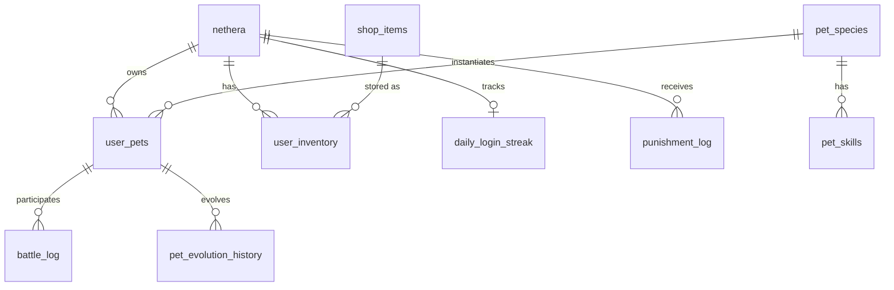

# Database Schema Documentation
**Mediterranean of Egypt - School Management System**

Last Updated: 19 Desember 2025

---

## Overview

Database ini menggunakan **MySQL/MariaDB** dengan koneksi via `mysqli`. Semua queries menggunakan **prepared statements** untuk mencegah SQL injection.

**Connection:** [`moe/config/connection.php`](file:///d:/School-Management-System/moe/config/connection.php)

---

## Core Tables

### 1. `nethera` - User/Student Table (Production Schema)

**Purpose:** Menyimpan data user utama (siswa, staff, admin)

| Column | Type | Description | Default |
|--------|------|-------------|--------|
| `id_nethera` | INT | Primary Key, User ID | AUTO_INCREMENT |
| `no_registrasi` | VARCHAR(20) | Registration number (e.g., AMMIT_1_17) | NULL |
| `nama_lengkap` | VARCHAR(100) | Full name | |
| `username` | VARCHAR(255) | Username untuk login | NULL |
| `email` | VARCHAR(100) | Email user | |
| `noHP` | VARCHAR(100) | Phone number | NULL |
| `password` | VARCHAR(255) | Hashed password (bcrypt) | |
| `reset_token` | VARCHAR(255) | Password reset token | NULL |
| `token_expires` | DATETIME | Reset token expiry | NULL |
| `id_sanctuary` | INT | FK to sanctuary/house (1-5) | NULL |
| `periode_masuk` | INT | Enrollment period | NULL |
| `status_akun` | ENUM | 'Aktif', 'Pending', 'Out', 'Hiatus' | 'Pending' |
| `otp_code` | VARCHAR(6) | Email verification OTP | NULL |
| `otp_expires` | DATETIME | OTP expiry time | NULL |
| `email_verified_at` | DATETIME | Email verification timestamp | NULL |
| `created_at` | TIMESTAMP | Registration date | CURRENT_TIMESTAMP |
| `updated_at` | TIMESTAMP | Last update | CURRENT_TIMESTAMP ON UPDATE |
| `role` | ENUM | 'Nethera', 'Vasiki' (student/staff) | 'Nethera' |
| `tanggal_lahir` | DATE | Birth date | NULL |
| `last_login` | DATETIME | Last login timestamp | NULL |
| `fun_fact` | TEXT | User's fun fact / bio | NULL |
| `profile_photo` | VARCHAR(255) | Path to profile photo | NULL |
| `gold` | INT | In-game currency untuk pet system | 500 |

**Relationships:**
- Has many `user_pets`
- Has many entries in `user_inventory`
- Has many entries in `daily_login_streak`
- Has many entries in `punishment_log`

---

### 2. `pet_species` - Pet Species/Types

**Purpose:** Master data untuk jenis-jenis pet yang tersedia

| Column | Type | Description |
|--------|------|-------------|
| `id` | INT | Primary Key |
| `name` | VARCHAR | Nama species (e.g., "Shadowfox", "Flamebird") |
| `element` | ENUM | 'Fire', 'Water', 'Earth', 'Air', 'Light', 'Dark' |
| `rarity` | ENUM | 'Common', 'Rare', 'Epic', 'Legendary' |
| `base_attack` | INT | Base ATK stat |
| `base_defense` | INT | Base DEF stat |
| `base_speed` | INT | Base SPD stat |
| `img_egg` | VARCHAR | Path to egg stage image |
| `img_baby` | VARCHAR | Path to baby stage image |
| `img_adult` | VARCHAR | Path to adult stage image |
| `passive_buff_type` | VARCHAR | Passive ability type |
| `passive_buff_value` | INT | Passive ability value |
| `description` | TEXT | Species description |

**Element Relationships:**
```
Fire > Air > Earth > Water > Fire
Light <-> Dark (mutual weakness)
```

**Rarity Distribution (Gacha Rates):**
- Common: 80% (normal gacha)
- Rare: 17%
- Epic: 2.5%
- Legendary: 0.5%

---

### 3. `user_pets` - User's Pet Instances

**Purpose:** Setiap pet yang dimiliki user (instances dari `pet_species`)

| Column | Type | Description | Default |
|--------|------|-------------|---------|
| `id` | INT | Primary Key | AUTO_INCREMENT |
| `user_id` | INT | FK to `nethera.id_nethera` | |
| `species_id` | INT | FK to `pet_species.id` | |
| `nickname` | VARCHAR | Custom pet name (nullable) | NULL |
| `level` | INT | Current level (1-100) | 1 |
| `exp` | INT | Current experience points | 0 |
| `evolution_stage` | ENUM | 'egg', 'baby', 'adult' | 'egg' |
| `health` | INT | HP stat (0-100) | 100 |
| `hunger` | INT | Hunger stat (0-100) | 100 |
| `mood` | INT | Mood stat (0-100) | 100 |
| `status` | ENUM | 'ALIVE', 'DEAD', 'SHELTER' | 'ALIVE' |
| `is_active` | BOOLEAN | Is currently active pet | 0 |
| `is_shiny` | BOOLEAN | Shiny variant (1% chance) | 0 |
| `shiny_hue` | INT | HSL hue for shiny (30-330) | 0 |
| `has_shield` | BOOLEAN | Active shield buff | 0 |
| `last_update_timestamp` | INT | Unix timestamp of last stat update | |
| `created_at` | TIMESTAMP | When pet was obtained | CURRENT_TIMESTAMP |

**Business Rules:**
- Max 25 pets per user
- Only 1 active pet at a time (`is_active = 1`)
- Lazy stat calculation based on `last_update_timestamp`
- Stats decay over time (see [Stat Decay](#stat-decay))
- Shiny pets: 1% chance, visual hue shift only (no stat bonus)

**Evolution Stages:**
- **Egg** (Level 1+) - Default start
- **Baby** (Level 10+) - Requires sacrifice evolution
- **Adult** (Level 20+) - Requires sacrifice evolution

---

### 4. `pet_skills` - Pet Skills/Abilities

**Purpose:** Skills yang dimiliki setiap species

| Column | Type | Description |
|--------|------|-------------|
| `id` | INT | Primary Key |
| `species_id` | INT | FK to `pet_species.id` |
| `skill_name` | VARCHAR | Nama skill |
| `skill_slot` | INT | Slot number (1-4) |
| `base_damage` | INT | Base damage multiplier |
| `element_type` | VARCHAR | Skill element |
| `effect_type` | VARCHAR | 'damage', 'heal', 'buff', 'debuff' |
| `effect_value` | INT | Effect magnitude |

---

### 5. `shop_items` - Shop Item Catalog

**Purpose:** Master data for items yang bisa dibeli di shop

| Column | Type | Description |
|--------|------|-------------|
| `id` | INT | Primary Key |
| `name` | VARCHAR | Item name |
| `description` | TEXT | Item description |
| `category` | ENUM | 'food', 'potion', 'gacha', 'special' |
| `effect_type` | VARCHAR | 'food', 'potion', 'revive', 'gacha_ticket', 'exp_boost', 'shield' |
| `effect_value` | INT | Effect magnitude |
| `price` | INT | Gold cost |
| `icon` | VARCHAR | Icon path |
| `is_purchasable` | BOOLEAN | Can be bought in shop |

**Item Types:**
- **Food** - Restores hunger
- **Potion** - Restores health
- **Revive** - Resurrects dead pet
- **Gacha Ticket** - Normal/Premium summon item
- **EXP Boost** - Direct EXP gain
- **Shield** - Blocks 1 attack in battle

---

### 6. `user_inventory` - User Item Inventory

**Purpose:** Items yang dimiliki setiap user

| Column | Type | Description |
|--------|------|-------------|
| `id` | INT | Primary Key |
| `user_id` | INT | FK to `nethera.id_nethera` |
| `item_id` | INT | FK to `shop_items.id` |
| `quantity` | INT | Item count |
| `obtained_at` | TIMESTAMP | When first obtained |

**Business Rules:**
- Stacking system: same item_id increases quantity
- Auto-delete when quantity <= 0
- ON DUPLICATE KEY UPDATE for item rewards

---

### 7. `daily_login_streak` - Daily Login Rewards

**Purpose:** Track daily login streak dan rewards

| Column | Type | Description |
|--------|------|-------------|
| `id` | INT | Primary Key |
| `user_id` | INT | FK to `nethera.id_nethera` (unique) |
| `current_day` | INT | Current streak day (1-7) |
| `last_claim_date` | DATE | Last claim date |
| `total_logins` | INT | Total times logged in |
| `created_at` | TIMESTAMP | First login |

**Reward System:**
- Day 1-6: Gold + Items
- Day 7: **Premium Gacha Ticket** (Epic+ guaranteed)
- Streak resets if missed a day

---

### 8. `pet_evolution_history` - Evolution Log

**Purpose:** Audit trail for pet evolutions

| Column |Type | Description |
|--------|------|-------------|
| `id` | INT | Primary Key |
| `user_id` | INT | FK to `nethera.id_nethera` |
| `main_pet_id` | INT | Pet that evolved |
| `fodder_pet_ids` | TEXT | JSON array of sacrificed pet IDs |
| `gold_cost` | INT | Gold spent (default 500) |
| `evolved_at` | TIMESTAMP | When evolution happened |

**Evolution Requirements:**
- **Egg → Baby**: Level 10+, 3 pets same rarity, 500 gold
- **Baby → Adult**: Level 20+, 3 pets same rarity, 500 gold

---
| `id` | INT | Primary Key | AUTO_INCREMENT |
| `name` | VARCHAR(100) | Achievement name | |
| `description` | TEXT | Achievement description | NULL |
| `category` | ENUM | 'collection','battle','level','gacha','login','special' | |
| `icon` | VARCHAR(50) | Emoji/icon for achievement | 🏆 |
| `rarity` | ENUM | 'bronze','silver','gold','platinum' | 'bronze' |
| `requirement_type` | VARCHAR(50) | Type of requirement | |
| `requirement_value` | INT | Required value to unlock | 1 |
| `reward_gold` | INT | Gold reward | 0 |
| `created_at` | TIMESTAMP | When achievement added | CURRENT_TIMESTAMP |

**Example Achievements:**
```
First Friend (bronze) - Obtain your first pet (50 gold)
Shiny Hunter (gold) - Obtain a shiny pet (200 gold)
Legendary Owner (platinum) - Obtain a legendary pet (500 gold)
Battle Legend (platinum) - Win 50 battles (500 gold)
Max Power (platinum) - Reach pet level 99 (1000 gold)
```

**Queries Found In:**
- Achievement tracking system

---

### 11. `admin_activity_log` - Admin Activity Tracking

**Purpose:** Audit trail for all admin actions

| Column | Type | Description |
|--------|------|-------------|
| `id` | INT | Primary Key |
| `admin_id` | INT | FK to `nethera.id_nethera` |
| `admin_username` | VARCHAR(100) | Admin's username |
| `action` | VARCHAR(20) | 'UPDATE', 'DELETE', 'CREATE' |
| `entity` | VARCHAR(50) | Entity type (nethera, grade, schedule) |
| `entity_id` | INT | ID of affected entity |
| `description` | TEXT | Human-readable description |
| `changes` | JSON | Before/after changes |
| `ip_address` | VARCHAR(45) | Admin's IP address |
| `user_agent` | VARCHAR(500) | Browser user agent |
| `created_at` | DATETIME | Action timestamp |

**Example Log Entry:**
```json
{
  "action": "UPDATE",
  "entity": "nethera",
  "entity_id": 285,
  "description": "Updated user: Cepoy",
  "changes": {
    "before": {"status_akun": "Pending"},
    "after": {"status_akun": "Aktif"}
  }
}
```

---

### 12. `class_grades` - Student Academic Grades

**Purpose:** Store class grades and performance points (PP) for students

| Column | Type | Description | Default |
|--------|------|-------------|--------|
| `id_grade` | INT | Primary Key | AUTO_INCREMENT |
| `id_nethera` | INT | FK to `nethera.id_nethera` | |
| `class_name` | VARCHAR(100) | Class name (e.g., "PP KHONSU #1") | |
| `english` | INT | English class grade | 0 |
| `herbology` | INT | Herbology class grade | 0 |
| `oceanology` | INT | Oceanology class grade | 0 |
| `astronomy` | INT | Astronomy class grade | 0 |
| `total_pp` | INT | Total performance points | 0 |

**Class Name Format:**
- Pattern: `PP [SANCTUARY]_[PERIOD]`
- Examples: "PP KHONSU #1", "PP HATHOR #3", "PP OSIRIS #2"

**Performance Points (PP):**
- Aggregated sum of all class grades
- Used for leaderboards/rankings

---

### 13. `class_schedule` - Class Schedule

**Purpose:** Define weekly class schedules

| Column | Type | Description |
|--------|------|-------------|
| `id_schedule` | INT | Primary Key |
| `class_name` | VARCHAR(100) | Subject name |
| `hakaes_name` | VARCHAR(100) | Teacher/instructor name |
| `schedule_day` | VARCHAR(50) | Day of week (Senin, Selasa, etc.) |
| `schedule_time` | VARCHAR(50) | Time (e.g., "19:00 WIB") |
| `class_image_url` | VARCHAR(255) | Class thumbnail image |
| `class_description` | TEXT | Class description |

**Available Classes:**
- Oceanology
- English
- Herbology
- History (Astronomy in grading)

---

### 14. `punishment_log` - Student Punishment Records

**Purpose:** Track student violations/punishments

| Column | Type | Description |
|--------|------|-------------|
| `id` | INT | Primary Key |
| `student_id` | INT | FK to `nethera.id_nethera` |
| `violation_type` | VARCHAR | Type of violation |
| `punishment` | TEXT | Punishment description |
| `given_by` | INT | Staff/admin who issued |
| `status` | ENUM | 'Active', 'Completed', 'Waived' |
| `created_at` | TIMESTAMP | When issued |
| `completed_at` | TIMESTAMP | When completed (nullable) |

---

## Stat Decay System

**Constants:** [`user/pet/logic/constants.php`](file:///d:/School-Management-System/moe/user/pet/logic/constants.php)

### Decay Rates (Per Hour)
- **Hunger**: -5/hour
- **Mood**: -3/hour
- **Health**: -8/hour (only when hunger = 0)

### Lazy Calculation
Stats are **not** updated in real-time. Instead:
1. Stats are recalculated when accessed (on-demand)
2. Calculation based on `last_update_timestamp`
3. Formula: `new_stat = old_stat - (decay_rate * hours_elapsed)`

### Death Condition
```
IF hunger <= 0 FOR extended period:
    health -= 8/hour
    
IF health <= 0:
    status = 'DEAD'
    (Requires Revive item to restore)
```

### Shelter Mode
When `status = 'SHELTER'`:
- **No stat decay**
- Pet cannot be used in battles
- Pet cannot be active
- Purpose: Preserve pet when AFK

---

## Relationships Diagram



---

## Query Examples

### Get User's Active Pet
```sql
SELECT up.*, ps.name as species_name, ps.element, ps.rarity
FROM user_pets up
JOIN pet_species ps ON up.species_id = ps.id
WHERE up.user_id = ? AND up.is_active = 1
LIMIT 1;
```

### Gacha Roll
```sql
-- 1. Select random species by rarity
SELECT * FROM pet_species 
WHERE rarity = ? 
ORDER BY RAND() 
LIMIT 1;

-- 2. Create pet instance
INSERT INTO user_pets 
(user_id, species_id, level, exp, health, hunger, mood, status, is_shiny, shiny_hue, last_update_timestamp)
VALUES (?, ?, 1, 0, 100, 100, 100, 'ALIVE', ?, ?, ?);
```

---

## Performance Considerations

### Indexes Recommended
```sql
CREATE INDEX idx_user_active ON user_pets(user_id, is_active);
CREATE INDEX idx_status ON user_pets(status);
CREATE INDEX idx_attacker ON battle_log(attacker_pet_id);
CREATE UNIQUE INDEX idx_user_item ON user_inventory(user_id, item_id);
```

---

## Security Notes

✅ **Implemented:**
- All queries use prepared statements
- Input validation via `core/sanitization.php`
- Environment variables for credentials (`.env`)

---

## References

**Related Files:**
- Database wrapper: [Database.php](file:///d:/School-Management-System/moe/core/Database.php)
- Connection config: [connection.php](file:///d:/School-Management-System/moe/config/connection.php)
- Pet logic: [pet/logic/](file:///d:/School-Management-System/moe/user/pet/logic/)

**See Also:**
- PET_SYSTEM.md - Pet mechanics documentation
- TRAPEZA_DOCUMENTATION.md - Banking system
