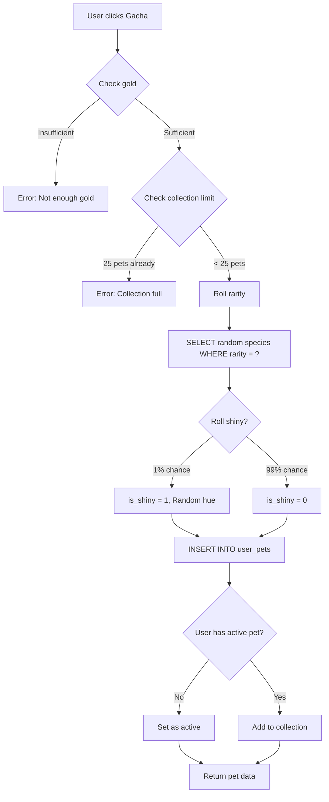
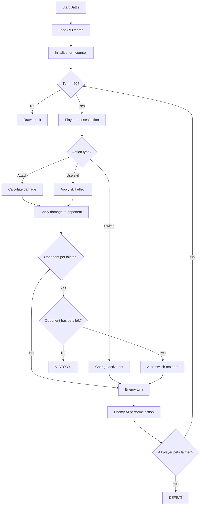

# Pet System Documentation
**Mediterranean of Egypt - Virtual Pet Companion**

Last Updated: 19 Desember 2025

---

## Table of Contents
1. [Overview](#overview)
2. [Gacha System](#gacha-system)
3. [Evolution System](#evolution-system)
4. [Battle System](#battle-system)
5. [Stat Management](#stat-management)
6. [Item System](#item-system)
7. [Daily Rewards](#daily-rewards)
8. [API Endpoints](#api-endpoints)

---

## Overview

Pet System di MOE adalah fitur **virtual pet companion** yang terinspirasi dari game seperti Dragon City, Neopets, dan Tamagotchi.

### Core Concepts

**Pet Lifecycle:**
```
Gacha Roll → Egg → Baby → Adult → Battle/Feed → Death? → Revive/Sell
```

**Key Features:**
- 🎲 **Gacha Rolling** - Summon pets dengan rarity system
- 🌟 **Shiny Variants** - 1% chance untuk visual variant
- 📈 **Evolution** - Sacrifice-based evolution (Egg → Baby → Adult)
- ⚔️ **Battle System** - PvE & PvP dengan element advantages
- 🎮 **Stat Decay** - Tamagotchi-style hunger/mood/health management
- 🛡️ **Shelter Mode** - Pause decay ketika AFK
- 💰 **Economy** - Gold-based shop & trading

---

## Gacha System

**Files:** [`user/pet/logic/gacha.php`](file:///d:/School-Management-System/moe/user/pet/logic/gacha.php), [`user/api/controllers/GachaController.php`](file:///d:/School-Management-System/moe/user/api/controllers/GachaController.php)

### Gacha Types

| Type | Cost | Guaranteed Rarity | Use Case |
|------|------|-------------------|----------|
| **Normal** | 100 gold | Any (Common-Legendary) | Free daily roll |
| **Rare+** | 300 gold | Rare or better | Mid-tier summon |
| **Premium** | Special items | Epic or better | Whale summon |

### Rarity Rates

**Normal Gacha:**
```javascript
Common:     80.0% (4 in 5 rolls)
Rare:       17.0% (17 in 100)
Epic:        2.5% (1 in 40)
Legendary:   0.5% (1 in 200)
```

**Rare+ Gacha:**
```javascript
Common:      0% (filtered out)
Rare:       85%
Epic:       13%
Legendary:   2%
```

**Premium Gacha:**
```javascript
Common:      0% (filtered out)
Rare:        0% (filtered out)
Epic:       75%
Legendary:  25% ⭐ (Great legendary rate!)
```

### Shiny System

- **Chance:** 1% (rolls independently from rarity)
- **Effect:** Visual only - HSL hue shift (30-330°)
- **No stat bonus** - Purely cosmetic
- **Formula:** `is_shiny = (rand(1, 100) === 1)`

### Collection Limit

- **Max pets per user:** 25
- Reason: Prevent database bloat & encourage curation
- Must sell/sacrifice pets to make room

### Gacha Flow



---

## Evolution System

**Files:** [`user/pet/logic/evolution.php`](file:///d:/School-Management-System/moe/user/pet/logic/evolution.php), [`user/api/controllers/EvolutionController.php`](file:///d:/School-Management-System/moe/user/api/controllers/EvolutionController.php)

### Evolution Stages

```
🥚 EGG (Lv 1+)  →  🐣 BABY (Lv 10+)  →  🦅 ADULT (Lv 20+)
```

### Evolution Requirements

**Egg → Baby:**
- Main pet level **≥ 10**
- **3 fodder pets** of **same rarity** as main pet
- **500 gold**

**Baby → Adult:**
- Main pet level **≥ 20**
- **3 fodder pets** of **same rarity** as main pet
- **500 gold**

### Sacrifice Mechanics

**Example:**
```
Main Pet: Shadowfox (Rare, Level 12, Egg stage)
Fodder: 3 Rare pets (any species, any level)
Cost: 500 gold

Result:
✅ Shadowfox evolves to BABY stage
✅ Level increases to 13 (+1 bonus)
❌ 3 fodder pets are DELETED
💰 500 gold deducted
```

### Business Rules

1. **Cannot evolve active pet while in battle**
2. **Fodder pets are permanently deleted** (sacrifice system)
3. **Evolution resets EXP to 0** (level stays)
4. **Same rarity requirement is strict** (Epic main ← Epic fodder only)
5. **Evolution is logged** in `pet_evolution_history`

### Why Sacrifice-Based?

> **Design Choice:** Prevents auto-evolution spam and creates meaningful choices. Players must decide: "Do I keep these 3 Rare pets, or sacrifice them to evolve my main?"

---

## Battle System

**Files:** [`user/pet/logic/battle.php`](file:///d:/School-Management-System/moe/user/pet/logic/battle.php), [`user/pet/logic/BattleEngine.php`](file:///d:/School-Management-System/moe/user/pet/logic/BattleEngine.php), [`user/api/controllers/BattleController.php`](file:///d:/School-Management-System/moe/user/api/controllers/BattleController.php)

### Battle Types

| Type | Mode | Rewards |
|------|------|---------|
| **1v1 Quick** | PvE | 20-50 gold, 30-60 EXP |
| **3v3 Arena** | PvE/PvP | 50-150 gold, 60-120 EXP |
| **Ranked Arena** | PvP | ELO rating + rewards |

### Element System

**Wheel:**
```
    🔥 FIRE
     ↓ (strong)
    💨 AIR
     ↓ (strong)
    🌍 EARTH
     ↓ (strong)
    💧 WATER
     ↓ (strong)
    🔥 FIRE...
```

**Special:**
```
☀️ LIGHT ⇄ 🌑 DARK (mutual weakness)
```

**Multipliers:**
- **Strong advantage:** 2.0× damage
- **Weak disadvantage:** 0.5× damage
- **Neutral:** 1.0× damage

### Damage Calculation

```php
// 1. Base stats
$base_attack = $pet['base_attack'];
$base_defense = $opponent['base_defense'];

// 2. Level scaling
$effective_attack = $base_attack * (1 + ($pet['level'] * 0.05));
$effective_defense = $base_defense * (1 + ($opponent['level'] * 0.05));

// 3. Element advantage
$element_multiplier = getElementMultiplier($attacker_element, $defender_element);

// 4. Damage formula
$damage = ($effective_attack - $effective_defense) * $element_multiplier;

// 5. RNG variance (±5%)
$damage *= rand(95, 105) / 100;

// 6. Minimum damage
$damage = max(5, $damage);
```

### Stat Formula

**Battle Stats** (different from hunger/mood/health):

```php
function calculateBattleStat($pet, $stat_type) {
    // Base stat from species
    $base_stat = $pet["base_$stat_type"];
    
    // Level bonus: +5% per level
    $level_bonus = 1 + ($pet['level'] * 0.05);
    
    // Evolution stage multiplier
    $stage_multiplier = [
        'egg' => 1.0,
        'baby' => 1.2,   // +20% stats
        'adult' => 1.5   // +50% stats
    ][$pet['evolution_stage']];
    
    return $base_stat * $level_bonus * $stage_multiplier;
}
```

### Skills System

Each pet has **4 skills** based on `pet_skills` table:
- Slot 1-4
- Each skill has: damage, element, effect type
- Skills loaded from database during battle init

### Battle Flow (3v3)



---

## Stat Management

**Files:** [`user/pet/logic/stats.php`](file:///d:/School-Management-System/moe/user/pet/logic/stats.php), [`user/pet/logic/constants.php`](file:///d:/School-Management-System/moe/user/pet/logic/constants.php)

### Core Stats

| Stat | Range | Purpose | Decay Rate |
|------|-------|---------|------------|
| **Health** | 0-100 | Pet vitality | 0/hour (unless starving) |
| **Hunger** | 0-100 | Food level | **-5/hour** |
| **Mood** | 0-100 | Happiness | **-3/hour** |

### Lazy Calculation

Stats are **not** updated in real-time. Calculation happens **on-demand** saat pet diakses:

```php
function updatePetStats($conn, $pet_id) {
    // 1. Get current pet data
    $pet = SELECT * FROM user_pets WHERE id = ?;
    
    // 2. Calculate time elapsed
    $hours_elapsed = (time() - $pet['last_update_timestamp']) / 3600;
    
    // 3. Skip if < 1 minute
    if ($hours_elapsed < 1/60) return $pet;
    
    // 4. Calculate new stats
    $new_hunger = max(0, $pet['hunger'] - (5 * $hours_elapsed));
    $new_mood = max(0, $pet['mood'] - (3 * $hours_elapsed));
    
    // 5. If starving (hunger = 0), health decays
    if ($new_hunger <= 0) {
        $new_health = max(0, $pet['health'] - (8 * $hours_elapsed));
    }
    
    // 6. Death check
    if ($new_health <= 0) {
        $status = 'DEAD';
    }
    
    // 7. Update database
    UPDATE user_pets SET hunger=?, mood=?, health=?, status=?, last_update_timestamp=? WHERE id=?;
    
    return $updated_pet;
}
```

### Death & Revival

**Death Trigger:**
1. Hunger reaches 0 (pet is starving)
2. After starvation, health decays at **-8/hour**
3. When health reaches 0 → `status = 'DEAD'`

**Revival:**
- Use **Revive item** (dari shop)
- Cost: varies by item tier
- Restores health to 50-100% (tergantung item)
- Also restores hunger=50, mood=50

### Shelter Mode

**Purpose:** Pause dari decay saat user AFK

**Effects:**
- ✅ **No stat decay** (hunger, mood, health frozen)
- ❌ Pet cannot battle
- ❌ Pet cannot be active
- ✅ Can shelter multiple pets

**Usage:**
```
PUT /api/router.php?endpoint=shelter
Body: { "pet_id": 123 }
```

---

## Item System

**Files:** [`user/pet/logic/items.php`](file:///d:/School-Management-System/moe/user/pet/logic/items.php), [`user/api/controllers/ShopController.php`](file:///d:/School-Management-System/moe/user/api/controllers/ShopController.php)

### Item Categories

#### 1. **Food Items**
- Effect: Restore hunger
- Example: "Fish Snack" (+30 hunger)
- Cannot feed dead pets

#### 2. **Potions**
- Effect: Restore health
- Example: "Health Potion" (+50 health)
- Cannot heal dead pets

#### 3. **Revive Items**
- Effect: Resurrect dead pets
- Example: "Phoenix Feather" (revive with 80% health)
- Quantity forced to 1

#### 4. **Gacha Tickets**
- Effect: Perform gacha roll
- Types:
  - Normal Ticket (gacha_type = 1)
  - Rare+ Ticket (gacha_type = 2)
  - Premium Ticket (gacha_type = 3)

#### 5. **EXP Boost**
- Effect: Direct EXP gain
- Example: "EXP Scroll" (+100 EXP)
- Can trigger level ups

#### 6. **Shield**
- Effect: Block 1 attack in battle
- Sets `has_shield = 1` on pet
- Consumed when hit in battle

### Item Usage Flow

```php
POST /api/router.php?endpoint=use_item
{
    "pet_id": 123,
    "item_id": 5,
    "quantity": 2
}

// Backend logic:
1. Check user owns item in inventory
2. Check sufficient quantity
3. Branch by effect_type:
   - gacha_ticket → performGacha()
   - food → UPDATE user_pets SET hunger = hunger + effect_value
   - potion → UPDATE user_pets SET health = health + effect_value
   - revive → UPDATE user_pets SET status='ALIVE', health=effect_value
   - exp_boost → addExpToPet()
   - shield → UPDATE user_pets SET has_shield=1
4. Deduct item from inventory
5. Return result
```

---

## Daily Rewards

**Files:** [`user/pet/logic/rewards.php`](file:///d:/School-Management-System/moe/user/pet/logic/rewards.php), [`user/api/controllers/RewardController.php`](file:///d:/School-Management-System/moe/user/api/controllers/RewardController.php)

### Login Streak System

7-day streak with escalating rewards:

| Day | Gold | Items | Special |
|-----|------|-------|---------|
| Day 1 | 50 | Food x1 | - |
| Day 2 | 75 | Potion x1 | - |
| Day 3 | 100 | Food x2 | - |
| Day 4 | 150 | Potion x2 | - |
| Day 5 | 200 | EXP Scroll x1 | - |
| Day 6 | 300 | Shield x1 | - |
| **Day 7** | **500** | **Premium Ticket** | ⭐ Epic+ guaranteed |

### Streak Logic

**Reset Condition:**
```php
$last_claim = $streak['last_claim_date'];
$today = date('Y-m-d');
$yesterday = date('Y-m-d', strtotime('-1 day'));

if ($last_claim != $yesterday && $last_claim != $today) {
    // Streak broken! Reset to Day 1
    $current_day = 1;
} else if ($last_claim == $yesterday) {
    // Consecutive day! Increment
    $current_day = ($streak['current_day'] % 7) + 1;
} else if ($last_claim == $today) {
    // Already claimed today
    return ['error' => 'Already claimed today'];
}
```

**Claim Process:**
1. Check if claimed today (prevent spam)
2. Calculate streak day
3. Distribute rewards:
   - Add gold to `nethera.gold`
   - Add items to `user_inventory` (ON DUPLICATE KEY UPDATE)
4. Update `daily_login_streak` table
5. Log transaction

---

## API Endpoints

**Router:** [`user/api/router.php`](file:///d:/School-Management-System/moe/user/api/router.php)

### Pet Management

```http
GET /api/router.php?endpoint=get_pets
Response: { "success": true, "pets": [...], "count": 5 }

GET /api/router.php?endpoint=get_active_pet
Response: { "success": true, "pet": {...} }

POST /api/router.php?endpoint=set_active
Body: { "pet_id": 123 }

POST /api/router.php?endpoint=rename_pet
Body: { "pet_id": 123, "nickname": "Shadowfox" }

POST /api/router.php?endpoint=shelter
Body: { "pet_id": 123 }

POST /api/router.php?endpoint=sell_pet
Body: { "pet_id": 123 }
Response: { "success": true, "gold_earned": 250, "new_balance": 1750 }
```

### Gacha

```http
POST /api/router.php?endpoint=perform_gacha
Body: { "gacha_type": 1 }
Response: {
    "success": true,
    "pet_id": 456,
    "species": {...},
    "is_shiny": false,
    "rarity": "Rare"
}
```

### Evolution

```http
POST /api/router.php?endpoint=evolve_pet
Body: {
    "main_pet_id": 123,
    "fodder_pet_ids": [45, 67, 89],
    "gold_cost": 500
}
Response: {
    "success": true,
    "new_stage": "baby",
    "new_level": 11
}
```

### Battle

```http
POST /api/router.php?endpoint=quick_battle
Body: { "attacker_pet_id": 123, "defender_pet_id": 456 }

POST /api/router.php?endpoint=start_3v3
Body: { "team": [12, 34, 56], "opponent_team": [78, 90, 11] }

POST /api/router.php?endpoint=battle_action
Body: { "battle_id": "abc123", "action": "attack", "target_index": 0 }
```

### Shop & Items

```http
GET /api/router.php?endpoint=get_shop_items
Response: { "success": true, "items": [...] }

POST /api/router.php?endpoint=purchase_item
Body: { "item_id": 5, "quantity": 3 }

POST /api/router.php?endpoint=use_item
Body: { "pet_id": 123, "item_id": 5, "quantity": 1 }
```

### Daily Rewards

```http
POST /api/router.php?endpoint=claim_daily_reward
Response: {
    "success": true,
    "day": 3,
    "gold_earned": 100,
    "items_received": [{"name": "Fish Snack", "quantity": 2}]
}

GET /api/router.php?endpoint=get_daily_streak
Response: {
    "current_day": 3,
    "last_claim_date": "2025-12-19",
    "total_logins": 45,
    "can_claim_today": false
}
```

---

## System Architecture

### File Organization

```
moe/user/
├── pet/
│   ├── logic/                  # Business logic layer
│   │   ├── constants.php       # System constants
│   │   ├── stats.php           # Stat calculation
│   │   ├── gacha.php           # Gacha mechanics
│   │   ├── evolution.php       # Evolution system
│   │   ├── battle.php          # Battle calculations
│   │   ├── BattleEngine.php    # Advanced battle logic
│   │   ├── BattleStateManager.php
│   │   ├── items.php           # Item usage
│   │   ├── rewards.php         # Daily rewards
│   │   ├── shelter.php         # Shelter mode
│   │   └── buffs.php           # Buff system
│   └── pet_loader.php          # Logic loader
├── api/
│   ├── BaseController.php      # Base controller class
│   ├── router.php              # API router
│   └── controllers/            # API controllers
│       ├── PetController.php
│       ├── BattleController.php
│       ├── GachaController.php
│       ├── EvolutionController.php
│       ├── ShopController.php
│       └── RewardController.php
├── js/
│   ├── pet.js                  # Main pet UI logic (73KB)
│   ├── pet_animations.js       # PixiJS animations
│   ├── pixi_pet.js             # Pet rendering
│   ├── pixi_battle.js          # Battle rendering
│   └── pet_arena.js            # Arena logic
└── css/
    ├── pet_v2.css              # Main pet styles (73KB)
    ├── gacha_premium.css       # Gacha UI
    └── my_pet_premium.css      # Collection UI
```

### Data Flow

```
User Action (Frontend)
    ↓
user/pet.js (AJAX request)
    ↓
user/api/router.php
    ↓
PetController/BattleController/etc. (validates, authorizes)
    ↓
user/pet/logic/*.php (business logic)
    ↓
core/Database.php (prepared statements)
    ↓
MySQL Database
    ↓
Response (JSON)
    ↓
user/pet.js (updates UI)
    ↓
PixiJS rendering (visual feedback)
```

---

## Constants Reference

From [`user/pet/logic/constants.php`](file:///d:/School-Management-System/moe/user/pet/logic/constants.php):

```php
// Stat Decay
HUNGER_DECAY_PER_HOUR = 5
MOOD_DECAY_PER_HOUR = 3
HEALTH_DECAY_WHEN_STARVING = 8

// Evolution
LEVEL_BABY = 5   // DEPRECATED (now sacrifice-based)
LEVEL_ADULT = 15 // DEPRECATED (now sacrifice-based)

// EXP
BASE_EXP_PER_LEVEL = 100
EXP_GROWTH_RATE = 1.2

// Gacha
GACHA_COST_NORMAL = 100
GACHA_COST_PREMIUM = 300
GACHA_RARITY_WEIGHTS = [
    'Common' => 80,
    'Rare' => 17,
    'Epic' => 2.5,
    'Legendary' => 0.5
]

// Battle
BATTLE_WIN_GOLD_MIN = 20
BATTLE_WIN_GOLD_MAX = 50
BATTLE_WIN_EXP_MIN = 30
BATTLE_WIN_EXP_MAX = 60

// 3v3 Battle
BATTLE_3V3_WIN_GOLD_MIN = 50
BATTLE_3V3_WIN_GOLD_MAX = 150
BATTLE_3V3_WIN_EXP_MIN = 60
BATTLE_3V3_WIN_EXP_MAX = 120

// Element System
ELEMENT_STRONG_MULTIPLIER = 2.0
ELEMENT_WEAK_MULTIPLIER = 0.5
ELEMENT_NEUTRAL_MULTIPLIER = 1.0

// Damage RNG
DAMAGE_RNG_MIN = 0.95
DAMAGE_RNG_MAX = 1.05
```

---

## Design Philosophy

### Why This System?

1. **Gacha = Retention** - Daily free roll keeps users coming back
2. **Sacrifice Evolution = Meaningful Choices** - Not just auto-level-up
3. **Stat Decay = Engagement** - Tamagotchi-style care loop
4. **Shelter = Respect Player Time** - No forced grinding
5. **Element Wheel = Strategic Depth** - Team composition matters
6. **Shiny System = Collection Hook** - Cosmetics for whales

### Balancing Considerations

**Current Tuning:**
- Gacha rates favor Common (80%) → encourages fodder collection
- Evolution requires same rarity → creates rarity tiers
- Premium gacha has 25% legendary → whale incentive
- Stat decay is slow (24h = -120 hunger) → casual-friendly
- Shelter mode = zero decay → respects player time

**Potential Adjustments:**
- Increase legendary rate in Premium (currently 25%)
- Add pity system (guaranteed legendary after N rolls)
- Faster stat decay for hardcore mode
- Evolution cost scaling (500 → 1000 for adult?)

---

## Future Enhancements

**Planned Features:**
- [ ] Breeding system (2 adult pets → egg)
- [ ] Pet skills customization
- [ ] Leaderboards (strongest pet, highest level)
- [ ] Guild battles (team vs team)
- [ ] Seasonal events (limited pets)
- [ ] Trading system (peer-to-peer)
- [ ] Achievement badges
- [ ] Pet cosmetics (hats, accessories)

**Technical Debt:**
- Refactor `pet.js` (73KB) to ES6 modules
- Add unit tests for battle calculations
- Optimize gacha animation performance
- Implement caching for species data

---

## References

**Related Documentation:**
- [DATABASE_SCHEMA.md](./DATABASE_SCHEMA.md) - Database tables & relationships
- [TRAPEZA_DOCUMENTATION.md](./TRAPEZA_DOCUMENTATION.md) - Banking system

**Code References:**
- Logic layer: [pet/logic/](file:///d:/School-Management-System/moe/user/pet/logic/)
- API controllers: [api/controllers/](file:///d:/School-Management-System/moe/user/api/controllers/)
- Frontend: [pet.js](file:///d:/School-Management-System/moe/user/js/pet.js)
- Constants: [constants.php](file:///d:/School-Management-System/moe/user/pet/logic/constants.php)
